[TOC]

# 广州数据分析师求职指南

## 分析思路
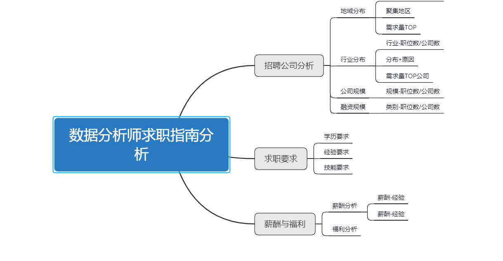

## 一.招聘需求分析
### 1.地域分布

广州的数据分析师职位主要集中在天河区，海珠区和番禺区，天河区有109个职位，占比59.2%；海珠区有32个职位，占比17.3%；番禺区有14个职位，占比7.6%；所以在在广州求职数据分析师可以投天河地区的公司，获得面试的几率高。

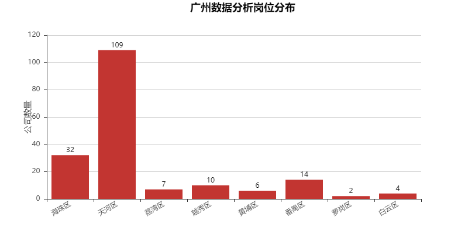
### 2.行业分布
职位前五排名集中于移动互联网、电商、数据服务，游戏，金融行业，这五个行业数量占比达73.3%；其中移动互联网占比高达35%；

数据分析的行业分布图显示，不出意料，掌握着大量用户数据的移动互联企业对数据分析师的需求还是最高的。职位需求TOP10中均为互联网，电商，金融等，没有传统的制造业或者服务业，不过也符合日常工作中会产生以及需要大量数据的领域，与常识相符合。

基于数据显示，所以求职者找传统服务行业或者制造业方向的需要注意。这类行业对数据分析需求程度低。

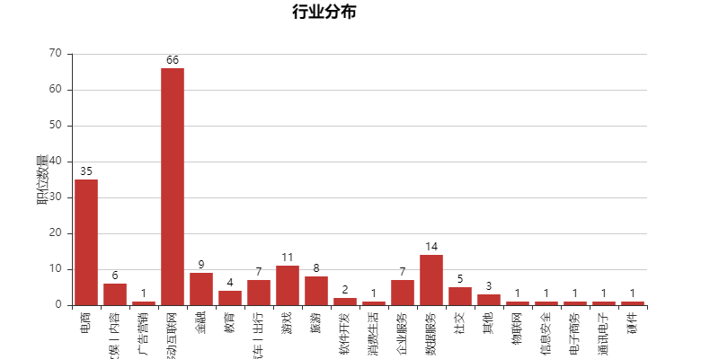
### 3.公司规模
**中等规模公司需求量最大**

500-2000人中等规模的公司的需求数量最大,占比达27.72%；规模少于15人的公司需求量最少，占比4.89%；

通过数据分析，求职者应该尽量找中等规模的公司，而尽量减少投规模小的公司。

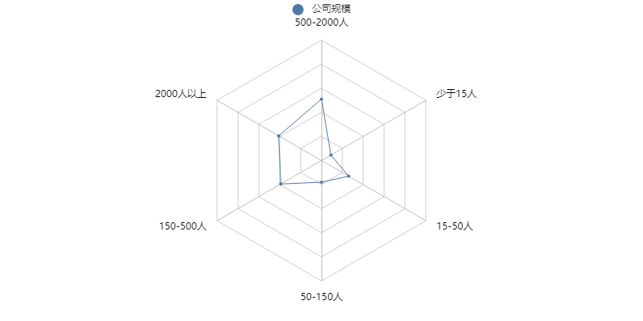
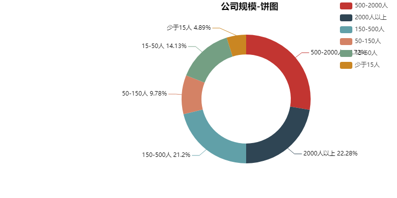

### 4.融资规模
未融资的企业需求量最大；D轮以上的公司的需求量最小，从数据上可以看出对于融资的企业，需求量随着融资轮数的增大，需求量也增大，由此可知推理可知，融资规模跟企业规模呈正比，而企业规模也跟需求量呈正比；但是其中D轮数据异常，不符合常识。

基于数据可知，求职者可以投递未融资企业以及上市公司，这两者的需求量最大，提高面试比例。
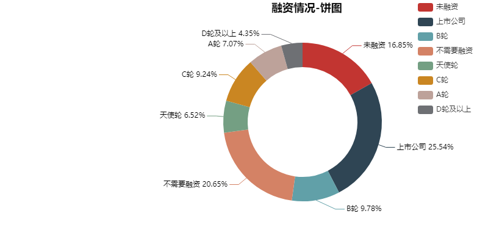
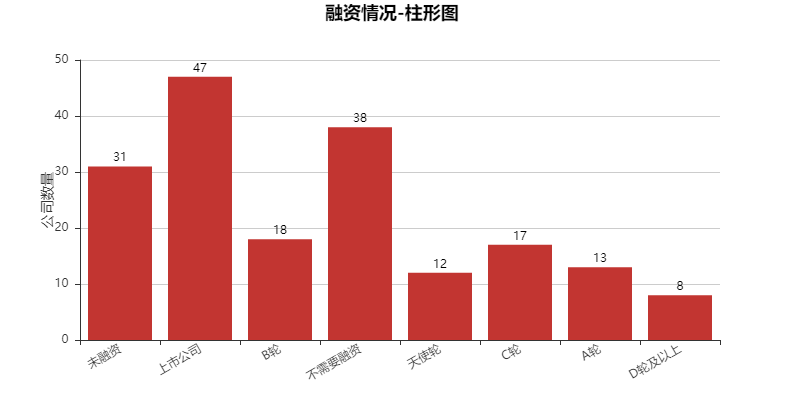

## 二.求职要求
### 1.学历要求
数据分析师的学历要求主要集中在本科学历，占比高达78.8%；硕士的占比最低，占2.17%；

通过数据显示可知，求职者求职数据分析时，本科学历基本是以门槛，如果学历未达要求，那么其实求职是很不占优势的，可能在简历阶段就被刷了。

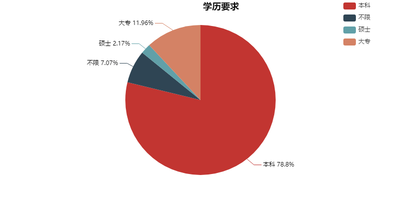
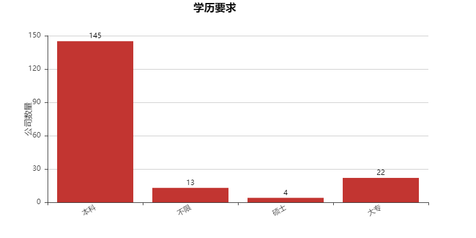
### 2.经验要求
基于经验漏斗图显示，数据分析师对于经验的要求还是比较高的，一般要求经验是3-5年，一年以下经验的企业基本不会要；

数据分析师一般是基于计算机科学数理统计的知识，再结合行业经验的职位，其对行业经验以及实际的工作经验要求较高，单纯只懂一些理论满足不了企业的需求，但是也有例外的情况，就是应届毕业生，企业愿意培养刚毕业的优秀应届生。
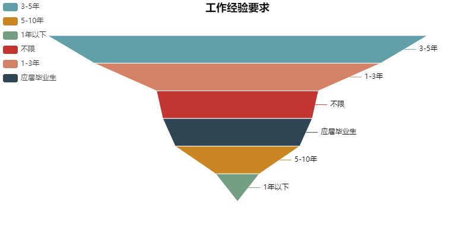
### 3.技能需求
**数据分析 MYSQL SPSS 可视化**

数据分析区别于数据挖掘，数据分析更加聚焦于数据的统计分析以及可视化，所以对技能的要求主要集中在数据库，以及一些统计软件SPSS，BI等，对于编程算法没有太大要求

## 三.薪酬与福利
### 1.薪资分析
根据数据图显示，数据分析师的薪资水平主要集中在5-15k,薪资的上限基本在35k;薪资水平在IT行业算是中等平均水平。

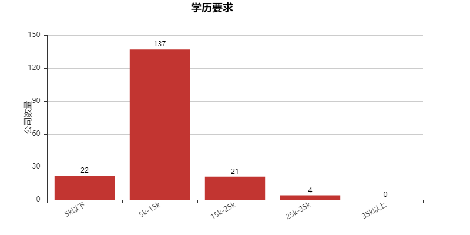
薪资与年限
### 2.福利分析

**五险一金 周末双休 绩效奖金 带薪年假**

五险一金，带薪年假还是比较符合正常企业的福利标准，但是数据分析师周末双休在996盛行的IT行业,确实是十分难得的福利；绩效奖金福利可以看出数据分析师是跟着团队做项目为主，所以有团队绩效
